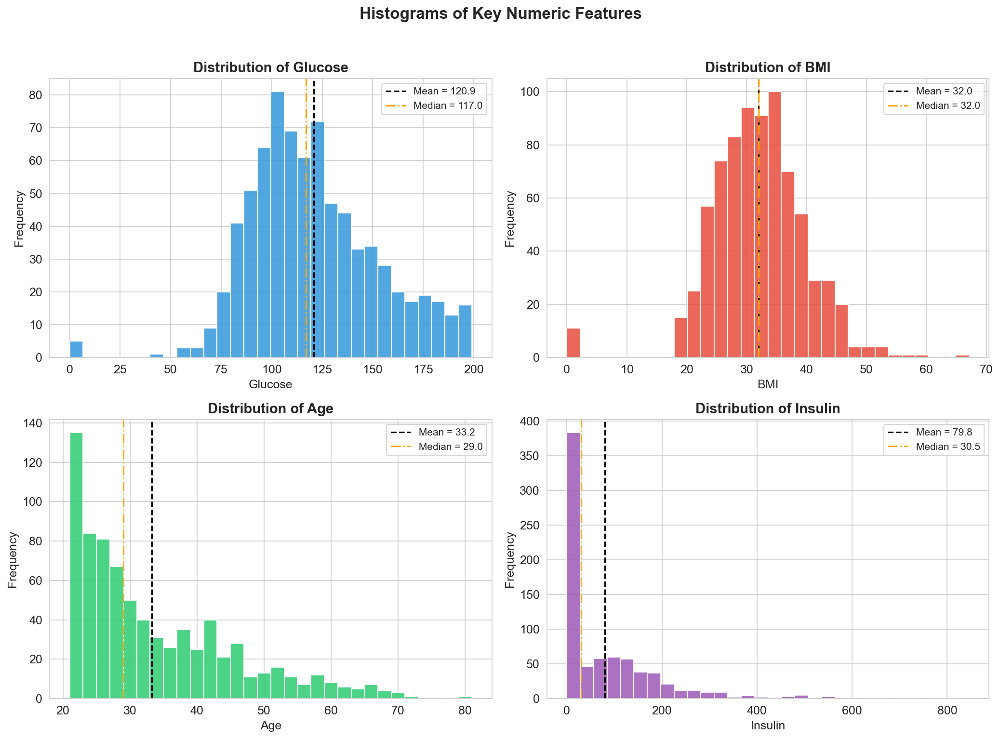
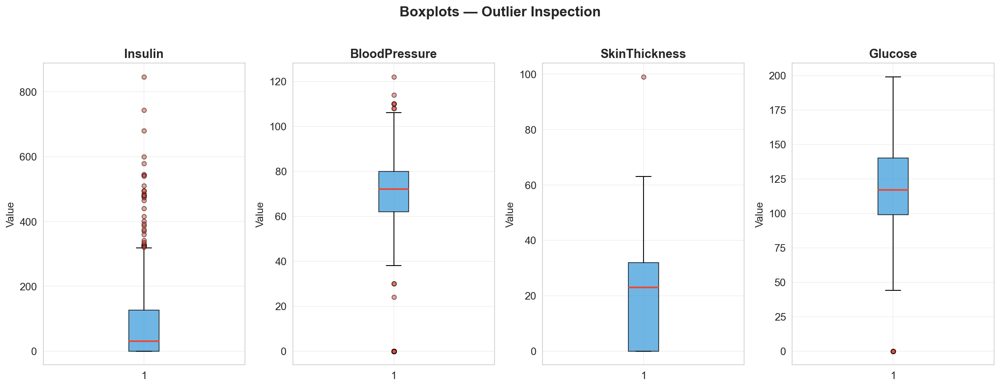
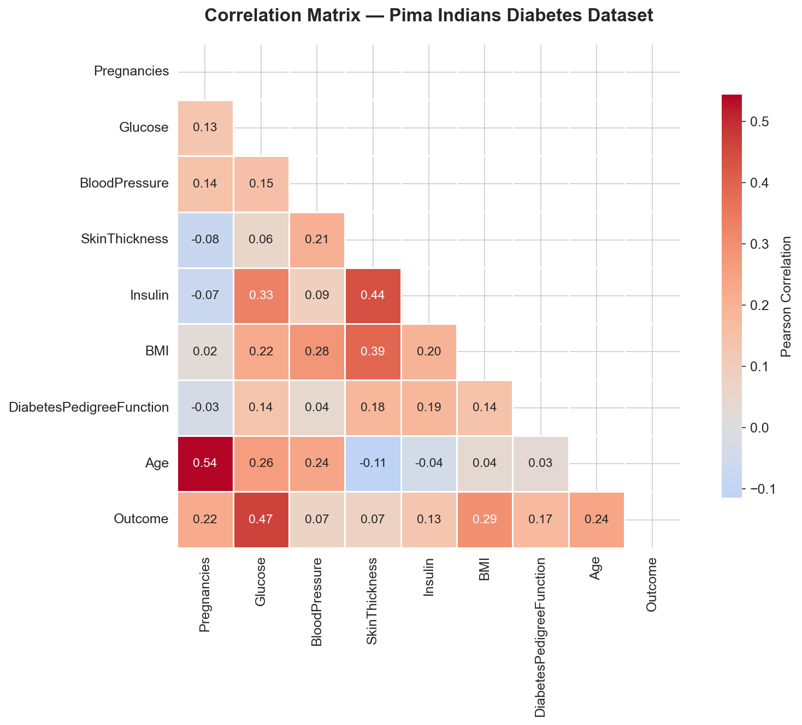
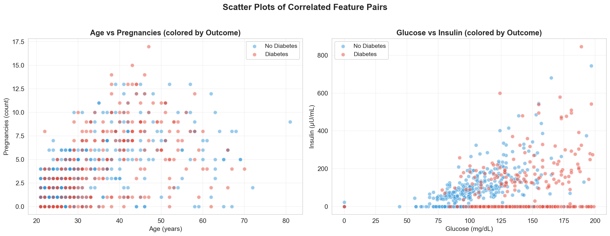
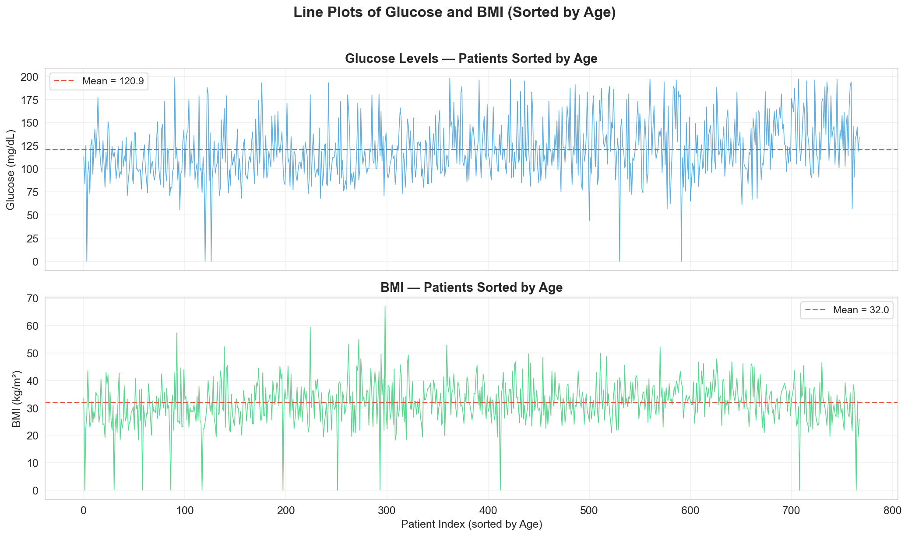
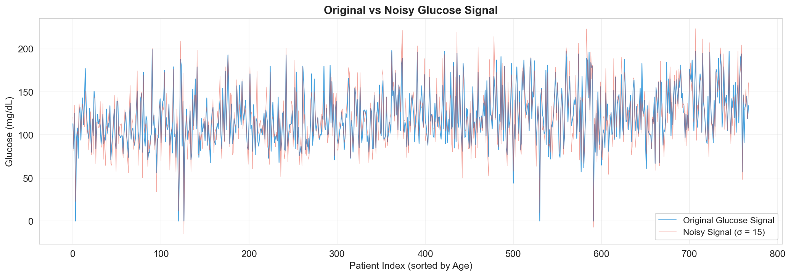
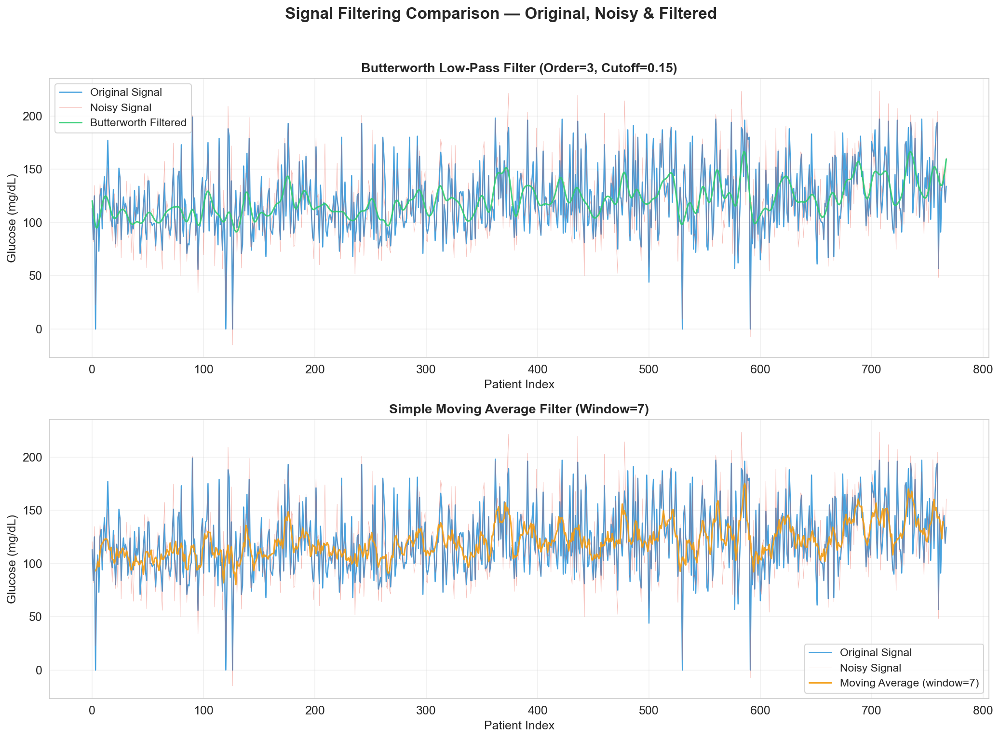
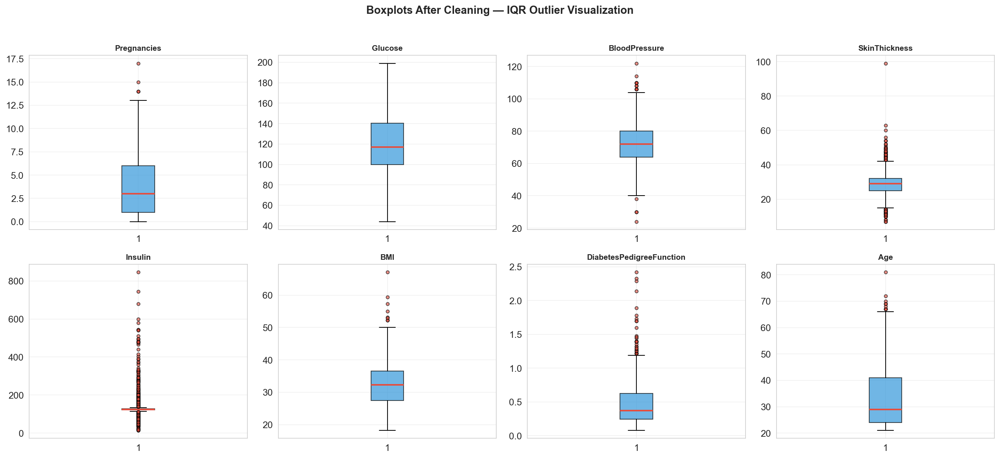
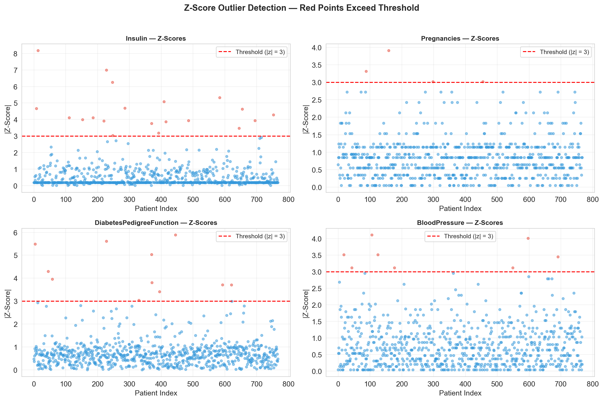
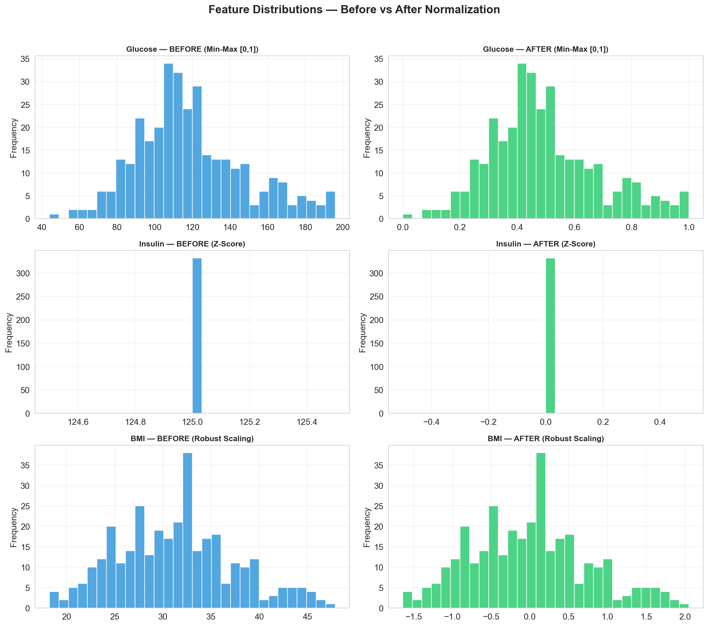

# Biomedical Data Analytics — Assignment 1
## Pima Indians Diabetes Dataset Analysis

| | |
|:---|:---|
| **Course** | Biomedical Data Analytics |
| **Institution** | Cairo University — Faculty of Engineering |
| **Student Name** | Mahmoud Mohamed Abdelfattah |
| **Student ID** | 4220142 |
| **Date** | 10 March 2026 |

---

## Dataset

| Property | Details |
|:---|:---|
| **Name** | Pima Indians Diabetes Database |
| **Source** | [Kaggle — UCI Pima Indians Diabetes](https://www.kaggle.com/datasets/uciml/pima-indians-diabetes-database) |
| **File** | `diabetes.csv` |
| **Rows** | 768 |
| **Columns** | 9 (8 features + 1 target) |
| **Data Types** | All numeric (int64 / float64) |

### Features

| # | Feature | Description | Unit |
|---|---------|-------------|------|
| 1 | Pregnancies | Number of times pregnant | count |
| 2 | Glucose | Plasma glucose concentration (2-hour OGTT) | mg/dL |
| 3 | BloodPressure | Diastolic blood pressure | mm Hg |
| 4 | SkinThickness | Triceps skin fold thickness | mm |
| 5 | Insulin | 2-hour serum insulin | μU/mL |
| 6 | BMI | Body mass index | kg/m² |
| 7 | DiabetesPedigreeFunction | Genetic predisposition score | score |
| 8 | Age | Patient age | years |
| 9 | Outcome (Target) | Diabetes diagnosis (0=No, 1=Yes) | binary |

### Why This Dataset?

- **Clinical relevance:** Diabetes is one of the most prevalent chronic diseases worldwide.
- **All-numeric features:** Ideal for statistical exploration, visualization, and normalization.
- **Sufficient size:** 768 records × 9 columns exceeds the minimum requirements (200+ rows, 5+ numeric columns).
- **Real patient data:** Collected from Pima Indian women aged ≥21 by the National Institute of Diabetes and Digestive and Kidney Diseases.
- **Known data quality issues:** Contains medically impossible zero values, making it excellent for practicing data cleaning techniques.

---

## Project Structure

```
Assignment-1/
├── Assignment1_Diabetes_Analysis.ipynb   # Main analysis notebook
├── diabetes.csv                          # Dataset
├── Assignment 1.md                       # Assignment specification
├── README.md                             # This file
└── screenshots/                          # Visualization outputs
    ├── 01_histograms.png
    ├── 02_boxplots.png
    ├── 03_correlation_heatmap.png
    ├── 04_scatter_plots.png
    ├── 05_line_plots.png
    ├── 06_noisy_signal.png
    ├── 07_filtered_signals.png
    ├── 08_iqr_boxplots.png
    ├── 09_zscore_outliers.png
    └── 10_normalization_comparison.png
```

---

## Results Summary

### Part 1 — Data Exploration

- **No explicit NaN values**, but significant **impossible zeros** found:
  - Insulin: 374 zeros (48.7%) — most affected
  - SkinThickness: 227 zeros (29.6%)
  - BloodPressure: 35 zeros (4.6%)
  - BMI: 11 zeros (1.4%)
  - Glucose: 5 zeros (0.7%)
- **Class distribution:** 500 non-diabetic (65.1%) vs 268 diabetic (34.9%) — moderate imbalance.
- **Key statistics:** Mean glucose ≈ 121 mg/dL (above normal), mean BMI ≈ 32 (obese), mean age ≈ 33 years.

### Part 2 — Exploratory Data Analysis (EDA)

**Histograms** (Glucose, BMI, Age, Insulin):
- Glucose: approximately normal with slight right skew
- BMI: roughly bell-shaped, centered at ~32 kg/m²
- Age: right-skewed (most patients 21–30)
- Insulin: heavily right-skewed with spike at 0 (missing data)



**Boxplots** (Insulin, BloodPressure, SkinThickness, Glucose):
- Insulin has extreme outliers (>600 μU/mL)
- BloodPressure shows impossible zeros and high outliers



**Correlation Heatmap:**
- Top 2 correlated feature pairs:
  1. **Age ↔ Pregnancies** (r = +0.54) — older women have more pregnancies (biological expectation)
  2. **Glucose ↔ Insulin** (r = +0.33) — higher glucose triggers higher insulin secretion (core diabetes pathophysiology)
- **Glucose ↔ Outcome** (r = +0.47) — strongest predictor of diabetes



**Scatter Plots:**



**Key EDA Observations:**
1. Insulin and SkinThickness suffer from massive missing data (48.7% and 29.6% zeros)
2. Glucose is the strongest predictor of diabetes outcome (r = 0.47)
3. Age and Pregnancies are strongly positively correlated (r = 0.54)
4. The study population is predominantly obese (mean BMI ≈ 32)

### Part 3 — Visualization & Filtering

**Line Plots** — Glucose and BMI sorted by patient age:



**Noisy Signal Simulation** — Gaussian noise (σ = 15) added to Glucose signal:



**Filtering** — Butterworth Low-Pass Filter (order=3, cutoff=0.15) and Moving Average (window=7):
- **Filter choice justification:** Butterworth has maximally flat frequency response in the passband — preserves signal shape without ripples. Zero-phase filtering via `filtfilt()` eliminates time delay.



### Part 4 — Cleaning & Normalization

**Missing Value Handling:**
- Replaced impossible zeros in Glucose, BloodPressure, SkinThickness, Insulin, BMI with **median** values
- **Justification:** Median imputation is robust to outliers and appropriate for skewed distributions

**Outlier Detection:**

| Method | Total Outliers Detected |
|:---|:---|
| **IQR** (1.5 × IQR) | More outliers detected (distribution-free) |
| **Z-Score** (\|z\| > 3) | Fewer outliers (assumes normality) |

- **Decision:** IQR method chosen for removal — distribution-free, robust for skewed biomedical data




**Normalization** (3 features, 3 methods):

| Feature | Method | Justification |
|:---|:---|:---|
| Glucose | **Min-Max [0, 1]** | Bounded clinical range, roughly normal distribution |
| Insulin | **Z-Score Standardization** | Highly right-skewed with large range; centers at mean=0, std=1 |
| BMI | **Robust Scaling** | Uses median/IQR instead of mean/std, robust to residual outliers |

**Before vs After Normalization:**



---

## Tools & Libraries

- **Python 3.12**
- pandas, numpy — data manipulation
- matplotlib, seaborn — visualization
- scipy (stats, signal) — statistical tests, Butterworth filter
- scikit-learn (preprocessing) — MinMaxScaler, StandardScaler, RobustScaler

---

## How to Run

1. Ensure Python 3.x is installed with the required libraries:
   ```
   pip install pandas numpy matplotlib seaborn scipy scikit-learn
   ```
2. Open `Assignment1_Diabetes_Analysis.ipynb` in Jupyter Notebook or VS Code.
3. Run all cells sequentially (Kernel → Restart & Run All).
4. Screenshots are automatically saved to the `screenshots/` folder by the final code cell.
